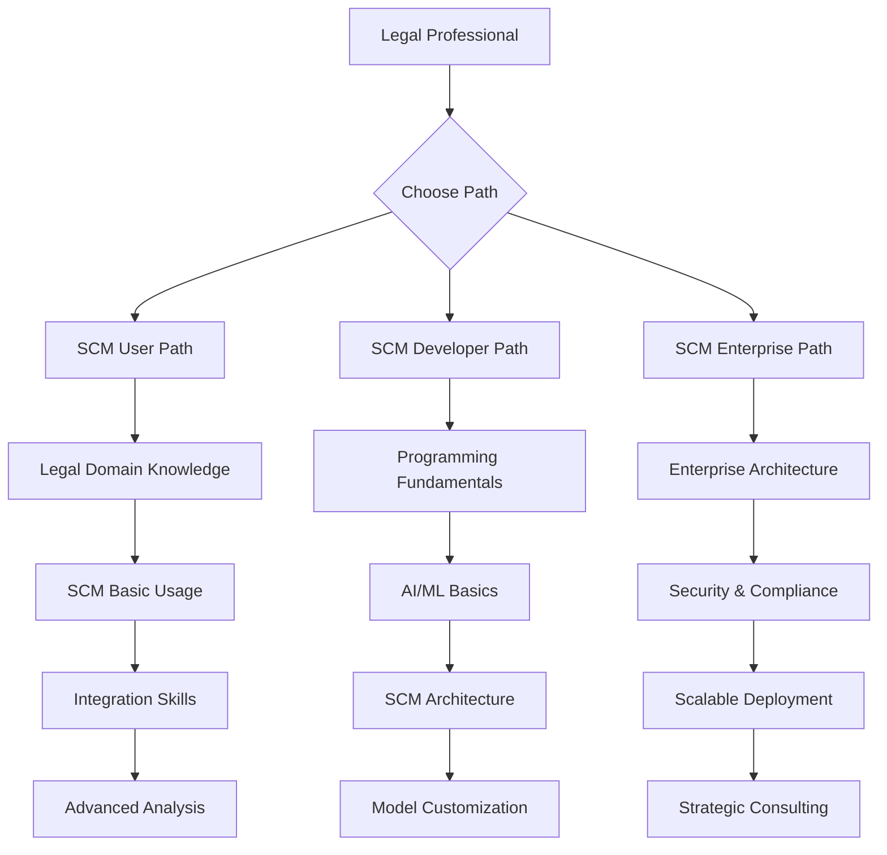

# Best Practices Integration: World-Class GitHub Repositories Analysis
## Adopting Excellence for SCM Legal Enterprise

### 🎯 **Objetivo**
Analizar y adoptar las mejores prácticas de repositorios GitHub clase mundial para elevar nuestro SCM Legal a estándares de excelencia internacional.

---

## 📊 **Análisis de Repositorios**

### 🌐 **1. Tolgee Platform - AI Localization Excellence**
**Repository**: `tolgee/tolgee-platform`  
**Stars**: 4.3K+ | **Contributors**: 50+ | **Enterprise Ready**: ✅

#### **🔍 Key Insights for SCM Legal:**

##### **A) Multi-Language Architecture Lessons**
```typescript
// Tolgee's approach to language management
interface LocalizationConfig {
  languages: string[]
  fallbackLanguage: string
  contextualTranslation: boolean
  aiTranslationProviders: ['deepl', 'google', 'aws']
}

// Applied to SCM Legal:
interface LegalJurisdictionConfig {
  jurisdictions: ['AR', 'ES', 'CL', 'UY']
  fallbackJurisdiction: 'AR'
  contextualLegalAnalysis: boolean
  aiLegalProviders: ['scm-legal', 'provider-a', 'provider-b']
}
```

##### **B) In-Context Editing Pattern** 
```javascript
// Tolgee: ALT+Click to edit translations in-place
// SCM Legal: ALT+Click to edit legal concepts in-place

class InContextLegalEditor {
  constructor() {
    this.enableInContextEditing = true
    this.shortcutKey = 'ALT'
  }
  
  onAltClick(legalText) {
    // Open legal concept editor dialog
    return this.openLegalConceptDialog(legalText)
  }
  
  openLegalConceptDialog(text) {
    return {
      originalText: text,
      detectedConcepts: this.extractLegalConcepts(text),
      suggestedAnalysis: this.generateLegalAnalysis(text),
      jurisdictionContext: this.detectJurisdiction(text)
    }
  }
}
```

##### **C) Collaborative Translation Workflow**
```yaml
# Tolgee workflow adapted for legal validation:
legal_validation_workflow:
  stages:
    1_ai_analysis: "SCM Legal generates initial analysis"
    2_expert_review: "Legal expert reviews and comments"  
    3_client_feedback: "Client provides domain-specific feedback"
    4_final_validation: "Senior legal expert approves"
  
  roles:
    - scm_ai: "AI legal analysis"
    - junior_lawyer: "Initial review and fact-checking"
    - senior_lawyer: "Final validation and approval"
    - client_expert: "Domain-specific knowledge input"
```

##### **D) Screenshot & Context Capture**
```python
# Tolgee: One-click screenshot with highlighted strings
# SCM Legal: One-click legal document analysis with highlighted concepts

class LegalDocumentCapture:
    def capture_legal_context(self, document_url):
        return {
            'screenshot': self.generate_screenshot(document_url),
            'highlighted_concepts': self.highlight_legal_concepts(),
            'jurisdiction_indicators': self.detect_jurisdiction_markers(),
            'risk_assessments': self.identify_risk_areas(),
            'metadata': {
                'capture_date': datetime.now(),
                'scm_version': self.get_scm_version(),
                'confidence_scores': self.get_confidence_metrics()
            }
        }
```

#### **🚀 Implementation for SCM Legal:**
1. **Multi-Jurisdictional Management**: Similar to Tolgee's language management
2. **In-Context Legal Editing**: ALT+Click for legal concept analysis
3. **Collaborative Legal Validation**: Expert review workflow
4. **Visual Legal Analysis**: Screenshot + highlighted legal concepts

---

### 🏗️ **2. System Design Primer - Scalable Architecture**  
**Repository**: `donnemartin/system-design-primer`  
**Stars**: 272K+ | **Impact**: Industry Standard | **Educational**: ✅

#### **🔍 Key Architecture Patterns for SCM Legal:**

##### **A) Distributed Systems for Legal AI**
```python
# System Design Primer principles applied to SCM Legal:

class SCMLegalDistributedArchitecture:
    def __init__(self):
        self.load_balancer = self.setup_load_balancer()
        self.concept_cache = self.setup_legal_concept_cache()  
        self.model_replicas = self.setup_scm_model_replicas()
        self.legal_database = self.setup_distributed_legal_db()
    
    def setup_load_balancer(self):
        # Route requests based on jurisdiction and complexity
        return {
            'argentina_requests': 'scm-legal-ar.servers',
            'spain_requests': 'scm-legal-es.servers', 
            'complex_analysis': 'scm-legal-enterprise.servers',
            'simple_queries': 'scm-legal-basic.servers'
        }
    
    def setup_legal_concept_cache(self):
        # Redis-based caching for legal concepts
        return {
            'concept_definitions': 'redis://legal-concepts.cache',
            'case_law_references': 'redis://case-law.cache',
            'regulatory_updates': 'redis://regulations.cache',
            'ttl': 3600  # 1 hour cache
        }
```

##### **B) CAP Theorem Applied to Legal Data**
```python
# Legal AI systems need to balance:
# - Consistency: Legal accuracy across jurisdictions  
# - Availability: 24/7 legal service availability
# - Partition tolerance: Handle network failures

class LegalCAP:
    def choose_consistency_model(self, use_case):
        if use_case == 'contract_analysis':
            return 'strong_consistency'  # Legal accuracy critical
        elif use_case == 'basic_queries':
            return 'eventual_consistency'  # Speed more important
        elif use_case == 'emergency_legal':
            return 'high_availability'  # Must be available
```

##### **C) Microservices Architecture for Legal Domains**
```yaml
# SCM Legal Microservices Architecture:
services:
  concept_extraction:
    responsibility: "Extract legal concepts from text"
    scaling: "High traffic, stateless"
    
  jurisdiction_router:
    responsibility: "Route to appropriate legal system"
    scaling: "Medium traffic, configuration-heavy"
    
  risk_assessment: 
    responsibility: "Analyze legal risks and compliance"
    scaling: "CPU intensive, batch processing"
    
  expert_validation:
    responsibility: "Human expert feedback integration" 
    scaling: "Low traffic, high value"
    
  client_portal:
    responsibility: "Client-facing API and dashboard"
    scaling: "Variable traffic, session management"
```

##### **D) Database Design for Legal Data**
```sql
-- Legal-optimized database architecture:

-- Concept hierarchy with jurisdiction support
CREATE TABLE legal_concepts (
    id UUID PRIMARY KEY,
    name VARCHAR(255) NOT NULL,
    jurisdiction VARCHAR(10) NOT NULL,
    category legal_category_enum,
    parent_concept_id UUID REFERENCES legal_concepts(id),
    confidence_threshold DECIMAL(3,2),
    created_at TIMESTAMP DEFAULT NOW(),
    
    INDEX idx_jurisdiction_category (jurisdiction, category),
    FULLTEXT INDEX idx_concept_search (name, description)
);

-- Sharding strategy by jurisdiction
CREATE TABLE legal_documents_ar PARTITION OF legal_documents 
FOR VALUES IN ('AR');
CREATE TABLE legal_documents_es PARTITION OF legal_documents  
FOR VALUES IN ('ES');
```

#### **🚀 Implementation for SCM Legal:**
1. **Microservices Architecture**: Separate services for each legal domain
2. **Distributed Caching**: Redis for legal concepts and case law
3. **Load Balancing**: Route by jurisdiction and complexity  
4. **Database Sharding**: Partition by jurisdiction for performance

---

### 📊 **3. Public APIs - Data Integration Excellence**
**Repository**: `public-apis/public-apis`  
**Stars**: 314K+ | **Categories**: 50+ | **Free Resources**: ✅

#### **🔍 Legal-Relevant APIs for SCM Enhancement:**

##### **A) Government & Legal APIs**
```python
# Curated legal APIs for SCM Legal integration:
LEGAL_APIS = {
    'argentina': {
        'legislation': 'http://servicios.infoleg.gob.ar/infolegInternet/anexos',
        'jurisprudence': 'https://www.cij.gov.ar/sentencias',
        'regulatory': 'https://www.argentina.gob.ar/normativa'
    },
    'spain': {
        'legislation': 'https://www.boe.es/buscar/legislacion.php',
        'jurisprudence': 'http://www.poderjudicial.es/search/indexAN.jsp',
        'regulatory': 'https://administracion.gob.es'
    },
    'international': {
        'treaties': 'https://treaties.un.org/pages/AdvanceSearch.aspx',
        'trade_law': 'https://www.wto.org/english/docs_e/legal_e/',
        'human_rights': 'https://www.ohchr.org/EN/HRBodies/Pages/TreatyBodies.aspx'
    }
}
```

##### **B) Data Enhancement APIs**
```python
# APIs for enriching legal analysis:
DATA_ENHANCEMENT_APIS = {
    'translation': {
        'deepl': 'https://api.deepl.com/v2/translate',
        'google_translate': 'https://translation.googleapis.com/language/translate/v2'
    },
    'document_processing': {
        'pdf_extraction': 'https://api.pdfshift.io/v3/convert/pdf',
        'ocr_processing': 'https://api.ocr.space/parse/image'
    },
    'legal_entities': {
        'company_info': 'https://api.opencorporates.com/companies',
        'regulatory_filings': 'https://www.sec.gov/Archives/edgar/data'
    },
    'financial_data': {
        'exchange_rates': 'https://api.exchangerate-api.com/v4/latest',
        'market_data': 'https://api.polygon.io/v2/aggs/ticker'
    }
}
```

##### **C) API Integration Architecture**
```python
class LegalAPIIntegrator:
    def __init__(self):
        self.api_cache = RedisCache()
        self.rate_limiters = self.setup_rate_limiters()
        self.fallback_providers = self.setup_fallbacks()
    
    async def enrich_legal_analysis(self, document, jurisdiction):
        """Enrich legal analysis with external APIs"""
        
        # Get legislative context
        legislation = await self.fetch_legislation(jurisdiction)
        
        # Get case law precedents  
        case_law = await self.fetch_case_law(document.concepts)
        
        # Get regulatory updates
        regulations = await self.fetch_recent_regulations(jurisdiction)
        
        # Combine with SCM analysis
        return self.combine_analysis(document, legislation, case_law, regulations)
    
    def setup_rate_limiters(self):
        return {
            'government_apis': RateLimiter(calls=100, period=3600),  # 100/hour
            'commercial_apis': RateLimiter(calls=1000, period=3600), # 1000/hour
            'translation_apis': RateLimiter(calls=500, period=3600)  # 500/hour
        }
```

#### **🚀 Implementation for SCM Legal:**
1. **Government API Integration**: Real-time legislation and case law
2. **Multi-Provider Fallbacks**: Redundancy for critical legal data
3. **Rate Limiting & Caching**: Efficient API usage management
4. **Data Enrichment Pipeline**: Enhance SCM analysis with external data

---

### 🎓 **4. Coding Interview University - Educational Excellence**
**Repository**: `jwasham/coding-interview-university`  
**Stars**: 305K+ | **Educational Impact**: Massive | **Structure**: ✅

#### **🔍 Educational Structure Lessons for SCM Legal:**

##### **A) Comprehensive Learning Path Structure**
```markdown
# SCM Legal Learning University (inspired by Coding Interview University)

## 📚 Legal AI Fundamentals (Week 1-2)
- [ ] Legal Systems Overview (Argentina, Spain, Chile, Uruguay)
- [ ] AI/ML Basics for Legal Applications  
- [ ] Natural Language Processing for Legal Text
- [ ] Ethics in Legal AI

## 🧠 SCM Architecture Deep Dive (Week 3-4)  
- [ ] Transformer Architecture for Legal Domain
- [ ] LoRA (Low-Rank Adaptation) Implementation
- [ ] Mixture of Experts (MoE) for Legal Concepts
- [ ] RLHF (Reinforcement Learning from Human Feedback)

## ⚖️ Legal Domain Specialization (Week 5-8)
- [ ] Constitutional Law Concepts and SCM Training
- [ ] Commercial Law Analysis and Risk Assessment  
- [ ] Corporate Governance and Compliance Automation
- [ ] Multi-Jurisdictional Legal Reasoning

## 🛠️ Production Deployment (Week 9-12)
- [ ] Enterprise Security and Compliance (SOC2, GDPR)
- [ ] Scalable Architecture Design
- [ ] Client Integration and Customization
- [ ] Performance Monitoring and Optimization
```

##### **B) Structured Documentation Pattern**
```python
# Documentation structure inspired by jwasham's methodology:

class SCMLegalDocumentation:
    def __init__(self):
        self.structure = {
            'getting_started': {
                'what_is_scm_legal': 'overview.md',
                'quick_start_guide': 'quickstart.md', 
                'installation': 'installation.md'
            },
            'core_concepts': {
                'legal_concept_modeling': 'concepts/modeling.md',
                'jurisdiction_handling': 'concepts/jurisdictions.md',
                'risk_assessment': 'concepts/risk.md'
            },
            'tutorials': {
                'contract_analysis': 'tutorials/contracts.md',
                'compliance_checking': 'tutorials/compliance.md',
                'custom_integration': 'tutorials/integration.md'
            },
            'advanced_topics': {
                'model_customization': 'advanced/customization.md',
                'enterprise_deployment': 'advanced/enterprise.md',
                'api_development': 'advanced/api.md'
            },
            'reference': {
                'api_documentation': 'reference/api.md',
                'configuration_options': 'reference/config.md',
                'troubleshooting': 'reference/troubleshooting.md'
            }
        }
```

##### **C) Progress Tracking System**
```yaml
# Learning progress tracking for SCM Legal:
progress_tracking:
  user_levels:
    - novice: "Basic legal concepts understanding"
    - intermediate: "Can implement simple SCM integrations"  
    - advanced: "Can customize models and deploy enterprise solutions"
    - expert: "Can contribute to SCM Legal development"
  
  skill_assessments:
    - legal_knowledge: "Understanding of target legal systems"
    - technical_skills: "AI/ML implementation capabilities"
    - integration_skills: "Ability to integrate with existing systems"
    - deployment_skills: "Production deployment and monitoring"
  
  certification_path:
    - scm_legal_practitioner: "Basic usage and integration"
    - scm_legal_developer: "Advanced customization and development"  
    - scm_legal_architect: "Enterprise architecture and consulting"
```

#### **🚀 Implementation for SCM Legal:**
1. **Structured Learning Path**: Progressive skill development program
2. **Comprehensive Documentation**: Multi-level documentation strategy  
3. **Progress Tracking**: Skill assessment and certification system
4. **Community Building**: Educational community around SCM Legal

---

### 🛣️ **5. Developer Roadmap - Technology Stack Optimization**
**Repository**: `kamranahmedse/developer-roadmap`  
**Stars**: 294K+ | **Technology Guidance**: ✅ | **Visual Learning**: ✅

#### **🔍 Technology Stack Lessons for SCM Legal:**

##### **A) SCM Legal Technology Roadmap**


##### **B) Minimal Technology Stack**
```yaml
# SCM Legal Minimal Stack (inspired by developer roadmap minimalism):
frontend:
  essential: "HTML, CSS, JavaScript"
  framework: "React or Vue.js"  
  styling: "Tailwind CSS"
  state: "Context API or Zustand"

backend:
  runtime: "Node.js or Python"
  framework: "Hono (for edge) or FastAPI"
  database: "PostgreSQL or SQLite"
  cache: "Redis"
  
ai_ml:
  framework: "PyTorch or Transformers"
  model_optimization: "LoRA/QLoRA"
  deployment: "ONNX or TensorRT"
  monitoring: "Weights & Biases"

deployment:
  containerization: "Docker"
  orchestration: "Kubernetes (optional)"
  edge_deployment: "Cloudflare Workers"
  monitoring: "Prometheus + Grafana"

security:
  authentication: "OAuth 2.0 / OIDC"
  encryption: "TLS 1.3, AES-256"
  compliance: "SOC 2, GDPR ready"
  secrets: "HashiCorp Vault"
```

##### **C) Learning Path Optimization**
```python
# Optimized learning paths based on user type:
LEARNING_PATHS = {
    'legal_professional': {
        'priority': ['legal_concepts', 'scm_usage', 'integration_basics'],
        'optional': ['technical_details', 'customization'],
        'duration': '2-4 weeks'
    },
    'technical_developer': {
        'priority': ['ai_ml_basics', 'scm_architecture', 'api_development'],
        'optional': ['legal_domain_knowledge', 'compliance'],
        'duration': '4-8 weeks'  
    },
    'enterprise_architect': {
        'priority': ['scalable_architecture', 'security', 'compliance'],
        'optional': ['detailed_implementation', 'model_training'],
        'duration': '2-6 weeks'
    }
}
```

#### **🚀 Implementation for SCM Legal:**
1. **Visual Learning Paths**: Clear technology progression roadmaps
2. **Minimal Stack Focus**: Essential technologies only, avoid complexity
3. **Role-Based Learning**: Customized paths for different user types
4. **Progressive Skill Building**: Step-by-step technology mastery

---

## 🎯 **Consolidated Best Practices for SCM Legal**

### **🏗️ Repository Structure Excellence**
```
SCM-Legal-Enterprise/
├── 📚 docs/                          # Comprehensive documentation (jwasham style)
│   ├── learning-paths/              # Structured learning (developer roadmap)
│   ├── tutorials/                   # Step-by-step guides
│   ├── architecture/                # System design documentation  
│   └── api-reference/               # Complete API docs
├── 
├── 🌐 src/                          # Multi-language support (tolgee inspired)
│   ├── core/                       # Core SCM engine
│   ├── jurisdictions/              # Jurisdiction-specific modules
│   ├── integrations/               # External API integrations (public-apis)
│   └── ui/                         # In-context editing interface
├── 
├── 🧠 models/                       # AI model management
│   ├── base-models/               # Foundation models
│   ├── adapters/                  # LoRA adapters by jurisdiction
│   └── configurations/            # Training configurations
├── 
├── 🔧 deployment/                  # Production deployment (system design)
│   ├── microservices/            # Service definitions
│   ├── infrastructure/           # Terraform, K8s configs
│   └── monitoring/               # Observability setup
├── 
├── 🧪 tests/                       # Comprehensive testing
│   ├── unit/                     # Unit tests
│   ├── integration/              # API integration tests  
│   └── legal-validation/         # Legal accuracy tests
└── 
└── 📊 analytics/                   # Business intelligence
    ├── usage-metrics/             # Usage analytics
    ├── performance/               # Performance monitoring
    └── business-intelligence/     # Revenue and client analytics
```

### **🚀 Implementation Priority Matrix**

| Priority | Feature | Inspiration Source | Timeline |
|----------|---------|-------------------|----------|  
| **High** | Multi-jurisdictional architecture | Tolgee localization | Week 1-2 |
| **High** | Microservices design | System Design Primer | Week 2-3 |
| **High** | API integration framework | Public APIs patterns | Week 3-4 |
| **Medium** | In-context legal editing | Tolgee ALT+Click | Week 4-5 |
| **Medium** | Learning path documentation | Coding Interview University | Week 5-6 |
| **Low** | Visual roadmap creation | Developer Roadmap | Week 6-7 |

### **📊 Success Metrics Inspired by Best Practices**

```python
success_metrics = {
    'tolgee_inspired': {
        'context_accuracy': 'Legal concepts correctly identified in context',
        'collaboration_efficiency': 'Expert validation workflow speed',
        'multi_jurisdiction_coverage': 'Percentage of legal systems supported'
    },
    'system_design_inspired': {
        'scalability': 'Requests per second handled',
        'availability': 'Uptime percentage (99.9% target)', 
        'consistency': 'Legal analysis accuracy across instances'
    },
    'educational_inspired': {
        'learning_completion_rate': 'Users completing learning paths',
        'documentation_quality': 'User satisfaction with docs',
        'community_growth': 'Contributors and active users'
    }
}
```

---

## 🎯 **Next Steps for Implementation**

### **Esta Semana**
1. ✅ **Analizar repositorios** y documentar best practices
2. 🔧 **Adoptar estructura** de documentación estilo jwasham
3. 🌐 **Implementar multi-jurisdictional** architecture (Tolgee inspired)
4. 📊 **Integrar public APIs** para enriquecimiento de datos

### **Próximas 2 Semanas**  
1. 🏗️ **Implement microservices** architecture (System Design Primer)
2. 📚 **Create learning paths** documentation (Coding Interview University)
3. 🛣️ **Visual technology roadmap** (Developer Roadmap style)
4. 🔧 **In-context editing** for legal concepts (Tolgee ALT+Click)

### **Próximo Mes**
1. 📈 **Full integration** of all best practices
2. 🎓 **Launch learning program** for SCM Legal
3. 🌐 **Community building** around educational content
4. 📊 **Metrics tracking** system implementation

---

**Resultado**: SCM Legal Enterprise elevado a estándares de excelencia internacional mediante adopción de mejores prácticas de los repositorios GitHub más respetados del mundo.

**Impact**: Framework clase mundial que combina excelencia técnica, educacional, arquitectural y operacional para dominar el mercado legal AI.