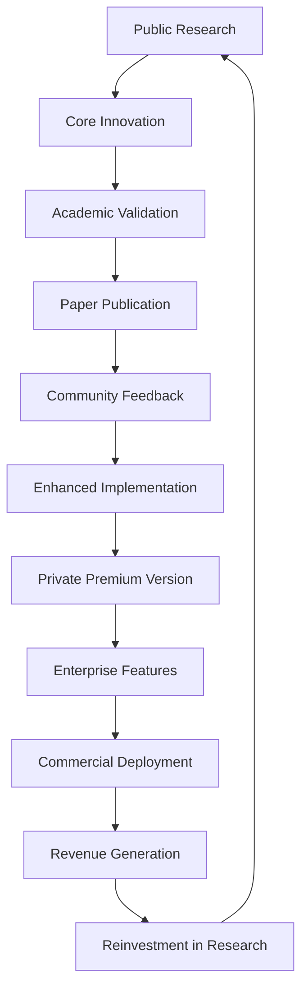

# SCM Legal: Estrategia Dual Repository
## Open Source Academic + Private Premium Commercial

### 🎯 **Objetivo Estratégico**
Maximizar **impacto académico** (open source) y **oportunidades comerciales** (premium privado) con estrategia de desarrollo dual coordenada.

---

## 📊 **Arquitectura de Repositorios**

### 🌐 **Repositorio Público: `SLM-Legal-Spanish` (Academic/Research)**
**URL**: https://github.com/adrianlerer/SLM-Legal-Spanish  
**Propósito**: Publicación académica, colaboración investigación, community building

#### **🔬 Contenido Open Source:**
```
SLM-Legal-Spanish/ (PUBLIC)
├── 📄 README.md                    # Academic positioning
├── 📔 SCM_Legal_Training.ipynb     # Colab training notebook  
├── 📋 PAPER_FRAMEWORK.md           # Research framework
├── 🏗️ SCM_LEGAL_ARCHITECTURE.md    # Technical architecture
├── 🧠 SCM_FREECODECAMP_INTEGRATION.md # Integration plan
├── 
├── training/                       # Core training framework
│   ├── scm_lora_trainer.py        # LoRA implementation
│   ├── legal_corpus_builder.py    # Corpus construction
│   ├── requirements-training.txt  # Dependencies
│   └── config/                    # Training configurations
├── 
├── src/                           # Demo application
│   ├── index.tsx                  # Main app (conceptual demo)
│   ├── routes/scm-legal.ts        # API endpoints (simulated)
│   └── components/                # UI components
├── 
├── docs/                          # Academic documentation
│   ├── RESEARCH_METHODOLOGY.md    # Methodology
│   ├── API.md                     # API documentation
│   └── BENCHMARKS.md              # Evaluation metrics
├── 
├── benchmarks/                    # Evaluation datasets
│   ├── legal_reasoning_benchmark.json
│   ├── multi_jurisdictional_test.json
│   └── professional_utility_eval.json
└── 
└── LICENSE                        # MIT License (permissive)
```

#### **🎯 Open Source Benefits:**
- **Academic Credibility**: Reproducible research, peer review
- **Community Contributions**: Researchers, students, legal tech developers
- **Citation Impact**: Papers, academic references, industry adoption  
- **Talent Attraction**: Developers, researchers, potential collaborators
- **Standards Setting**: Become reference implementation for legal AI

---

### 🔒 **Repositorio Privado: `SCM-Legal-Pro` (Commercial/Premium)**
**URL**: https://github.com/adrianlerer/SCM-Legal-Pro (Private)  
**Propósito**: Monetización, clientes enterprise, servicios profesionales

#### **💼 Contenido Premium:**
```
SCM-Legal-Pro/ (PRIVATE)
├── 🔒 README_ENTERPRISE.md         # Enterprise positioning
├── 💎 PREMIUM_FEATURES.md          # Premium capabilities
├── 📈 BUSINESS_MODEL.md            # Monetization strategy
├── 🛡️ SECURITY_COMPLIANCE.md       # Enterprise security
├── 
├── src-premium/                    # Production-grade implementation
│   ├── enterprise_api/            # Scalable API architecture
│   ├── advanced_models/           # Enhanced SCM models
│   ├── security/                  # Enterprise security layer
│   ├── analytics/                 # Usage analytics & insights
│   └── integrations/              # Third-party integrations
├── 
├── models/                        # Trained production models
│   ├── scm_legal_argentina_pro.bin    # Full country-specific
│   ├── scm_legal_spain_pro.bin        # models (not in public)
│   ├── scm_legal_chile_pro.bin        
│   ├── scm_legal_uruguay_pro.bin      
│   └── scm_legal_multilingual_pro.bin # Premium multi-jurisdiction
├── 
├── training-enterprise/           # Enhanced training pipeline
│   ├── professional_corpus/       # Premium legal datasets
│   ├── expert_feedback_system/    # Real expert validation
│   ├── continuous_learning/       # Model updates & improvements
│   └── custom_fine_tuning/        # Client-specific adaptations
├── 
├── deployment/                    # Enterprise deployment
│   ├── kubernetes/                # K8s configurations
│   ├── docker/                    # Production containers
│   ├── terraform/                 # Infrastructure as Code
│   ├── monitoring/                # Prometheus, Grafana
│   └── backup/                    # Data backup strategies
├── 
├── clients/                       # Client-specific implementations
│   ├── law_firm_template/         # Law firm integration
│   ├── corporate_legal/           # Corporate legal departments
│   ├── regulatory_bodies/         # Government & regulators
│   └── legal_tech_platforms/      # SaaS integrations
├── 
├── premium_apis/                  # Advanced API endpoints
│   ├── bulk_document_analysis/    # High-volume processing
│   ├── real_time_legal_alerts/    # Regulatory change monitoring
│   ├── risk_assessment_suite/     # Advanced risk analysis
│   └── compliance_automation/     # Automated compliance checking
├── 
├── professional_services/         # Consulting & services
│   ├── implementation_guides/     # Client onboarding
│   ├── training_materials/        # Professional training
│   ├── customization_templates/   # Industry-specific configs
│   └── support_documentation/     # Enterprise support
└── 
└── LICENSE_COMMERCIAL             # Commercial license terms
```

#### **💰 Premium Advantages:**
- **Production Models**: Fully trained, optimized, production-ready
- **Enterprise Features**: Scalability, security, compliance, SLA
- **Professional Services**: Implementation, training, customization
- **Continuous Updates**: Model improvements, new features, support
- **Client-Specific**: Custom fine-tuning, industry adaptations

---

## 🔄 **Flujo de Desarrollo Coordinado**

### **📈 Public → Private Enhancement Flow:**


### **🔬 Development Strategy:**

#### **Phase 1: Foundation (Current)**
- ✅ **Public**: Core LoRA framework, academic positioning
- 🔄 **Private**: Enhanced architecture planning, business model

#### **Phase 2: Academic Publication (Next 2-3 months)**
- 📄 **Public**: Paper submission, benchmark datasets, reproducible results
- 💼 **Private**: Professional validation, enterprise architecture design

#### **Phase 3: Commercial Launch (3-6 months)**
- 🌐 **Public**: Community building, developer adoption, standards setting  
- 🔒 **Private**: Enterprise sales, professional services, revenue generation

#### **Phase 4: Scaling (6-12 months)**
- 🔬 **Public**: Advanced research, new methodologies, academic leadership
- 💰 **Private**: Market expansion, enterprise features, strategic partnerships

---

## 💼 **Modelos de Monetización Premium**

### **1. Software Licencing (SaaS)**
```python
pricing_tiers = {
    "Professional": {
        "price": "$299/month",
        "features": ["Production models", "API access", "Basic support"],
        "target": "Small law firms, solo practitioners"
    },
    "Enterprise": {
        "price": "$2,999/month", 
        "features": ["Custom models", "Bulk processing", "Priority support"],
        "target": "Large law firms, corporate legal departments"
    },
    "Government": {
        "price": "Custom pricing",
        "features": ["On-premise deployment", "Compliance certification"],
        "target": "Regulatory bodies, government agencies"
    }
}
```

### **2. Professional Services**
```python
services_portfolio = {
    "Implementation": "$50K - $200K per project",
    "Custom Training": "$25K - $100K per model",
    "Integration": "$15K - $75K per platform", 
    "Consulting": "$500 - $1,500 per hour",
    "Training": "$10K - $50K per program"
}
```

### **3. Data & Analytics**
```python
premium_offerings = {
    "Legal Intelligence Reports": "$5K/month subscription",
    "Regulatory Change Alerts": "$2K/month subscription", 
    "Market Analysis": "$10K per report",
    "Compliance Benchmarking": "$15K per assessment"
}
```

---

## 🛡️ **Protección de IP y Competitividad**

### **🔓 Open Source Strategy:**
- **MIT License**: Permissive para maximum adoption
- **Academic Focus**: Research methodology, not production secrets
- **Community Building**: Contributors, researchers, adopters
- **Standard Setting**: Become de-facto reference for legal AI

### **🔒 Private IP Protection:**
```python
competitive_advantages = {
    "Production Models": "Fully trained, optimized models (not in public)",
    "Enterprise Architecture": "Scalable, secure, compliant deployment", 
    "Professional Datasets": "Curated legal corpus with expert validation",
    "Domain Expertise": "30+ years legal experience integration",
    "Regulatory Knowledge": "Multi-jurisdictional compliance specialization",
    "Professional Network": "Access to legal experts, law firms, corporates"
}
```

### **📋 IP Strategy:**
- **Patents**: File for novel technical approaches (MoE + LoRA + RLHF legal)
- **Trade Secrets**: Keep proprietary datasets, optimization techniques private
- **Trademarks**: Protect brand names, product names, methodologies
- **Copyrights**: Protect proprietary code, documentation, training materials

---

## 🤝 **Colaboración y Partnerships**

### **🎓 Academic Collaborations (Public):**
- **Universities**: Joint research, PhD students, academic papers
- **Research Labs**: Technical collaboration, methodology development
- **Legal Academia**: Law school partnerships, legal research integration
- **Open Source Community**: Contributors, maintainers, evangelists

### **💼 Commercial Partnerships (Private):**
- **Law Firms**: Pilot programs, case studies, professional validation
- **Legal Tech**: Integration partnerships, white-label solutions
- **Enterprise Software**: ERP/CRM integrations, workflow automation
- **Government**: Regulatory compliance tools, policy analysis systems

### **🌐 Strategic Alliances:**
```python
partnership_targets = {
    "Technology": ["Microsoft", "Google Cloud", "AWS", "Hugging Face"],
    "Legal": ["Thomson Reuters", "LexisNexis", "Westlaw", "vLex"], 
    "Consulting": ["Deloitte", "PwC", "EY", "KPMG"],
    "Academia": ["Stanford", "MIT", "Oxford", "Universidad de Buenos Aires"]
}
```

---

## 📈 **Métricas de Éxito**

### **🔬 Academic Success (Public):**
```python
academic_kpis = {
    "Citations": "Target 100+ citations in first year",
    "GitHub Stars": "Target 1,000+ stars", 
    "Contributors": "Target 50+ active contributors",
    "Papers": "5+ follow-up research papers",
    "Conferences": "Presentations at top AI/Law conferences"
}
```

### **💰 Commercial Success (Private):**
```python
business_kpis = {
    "Revenue": "$1M ARR by year 2",
    "Clients": "50+ enterprise clients by year 2", 
    "Market Share": "5% of legal AI market in target regions",
    "Profitability": "Positive cash flow by month 18",
    "Valuation": "$10M+ valuation for potential exit/funding"
}
```

---

## 🚀 **Implementation Roadmap**

### **Q1 2025: Foundation**
- ✅ **Public**: Complete academic framework, paper submission
- 🔄 **Private**: MVP enterprise version, first pilot clients

### **Q2 2025: Launch**  
- 📄 **Public**: Paper publication, conference presentations
- 💼 **Private**: Commercial launch, professional services

### **Q3 2025: Scaling**
- 🌐 **Public**: Community growth, academic partnerships
- 📈 **Private**: Revenue growth, market expansion

### **Q4 2025: Leadership**
- 🏆 **Public**: Thought leadership, industry recognition
- 🚀 **Private**: Strategic partnerships, potential funding/exit

---

**Resultado**: Estrategia dual que maximiza impacto académico (open source) y oportunidades comerciales (premium), estableciendo liderazgo tanto en investigación como en mercado legal AI.

**Autor**: Ignacio Adrian Lerer  
**Objetivo**: World-class SCM Legal ecosystem - academic excellence + commercial success