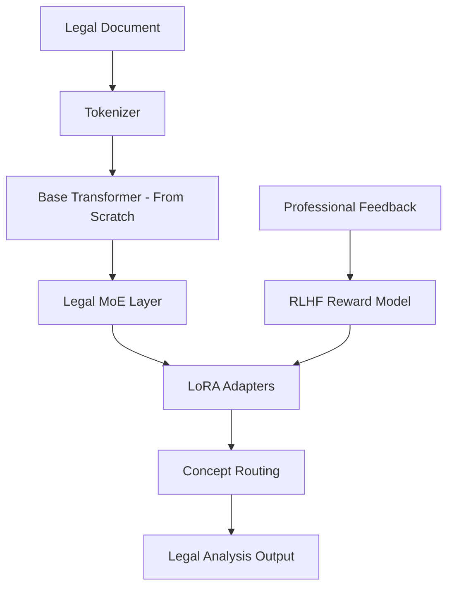

# SCM Legal Enhancement Roadmap
## Integración FreeCodeCamp LLM Tutorial + Microsoft LoRA

### 🎯 Objetivo
Combinar implementación desde cero (FreeCodeCamp) con eficiencia LoRA (Microsoft) para SCM Legal clase mundial.

## 📚 Recursos Base

### ✅ Ya Implementado (Fase 2)
- **Microsoft LoRA Framework** (paper 2106.09685)
- **QLoRA 4-bit quantization**
- **Multi-concept adapters** por dominio legal
- **Academic training pipeline**
- **Colab deployment ready**

### 🆕 FreeCodeCamp Integration (Fase 3)
- **Tutorial**: https://www.freecodecamp.org/news/code-an-llm-from-scratch-theory-to-rlhf
- **YouTube**: https://youtu.be/p3sij8QzONQ (6 horas)
- **GitHub**: Codebase completo disponible

## 🔬 Plan de Integración

### **Phase 3A: Core Architecture Understanding**
```python
# Del tutorial FreeCodeCamp - implementar:
1. Core Transformer desde cero
2. Modern enhancements (RMSNorm, RoPE, KV caching)  
3. Mixed precision training
4. Rich logging y monitoring

# Aplicar a SCM Legal:
- Optimizar target modules LoRA
- Mejorar efficiency legal concept processing
- Enhanced monitoring académico
```

### **Phase 3B: Legal-Specific Enhancements**
```python
# Mixture of Experts para Legal Concepts:
legal_moe = {
    "constitutional_expert": ConstitutionalLawMoE(),
    "commercial_expert": CommercialLawMoE(), 
    "compliance_expert": ComplianceMoE(),
    "civil_expert": CivilLawMoE()
}

# Hybrid Architecture:
Base Transformer + LoRA Adapters + Legal MoE + RLHF
```

### **Phase 3C: RLHF Legal Alignment**
```python
# Reward Modeling con Expertos Legales:
1. Supervised Fine-Tuning con corpus legal
2. Reward model training con feedback profesional
3. PPO alignment para criterios jurídicos
4. Professional utility optimization
```

## 🛠️ Implementation Plan

### **Week 1: Core Understanding**
- [ ] **Estudiar tutorial completo** FreeCodeCamp (6 horas)
- [ ] **Implementar transformer básico** desde cero
- [ ] **Comparar con LoRA approach** - identificar sinergias
- [ ] **Documentar insights** para paper académico

### **Week 2: Legal MoE Integration**
- [ ] **Diseñar Legal MoE architecture**
- [ ] **Implementar concept-specific experts**
- [ ] **Integrar con framework LoRA existente**
- [ ] **Benchmarking performance** vs LoRA puro

### **Week 3: RLHF Legal**
- [ ] **Implementar reward modeling** para dominio legal
- [ ] **Crear dataset feedback** expertos legales
- [ ] **PPO training** con criterios jurídicos
- [ ] **Validation professional** utility

### **Week 4: Academic Integration**
- [ ] **Métricas comparativas** LoRA vs Hybrid vs From-scratch
- [ ] **Paper enhancement** con nuevos resultados
- [ ] **Code optimization** production-ready
- [ ] **Submission preparation** AAAI/ACL 2025

## 🔄 Arquitectura Híbrida Propuesta



## 📊 Expected Benefits

### **1. Deeper Control**
- **Custom architecture** optimizada para legal reasoning
- **Legal-specific optimizations** no disponibles en modelos base
- **Full transparency** para explicabilidad jurídica

### **2. Efficiency Gains**
- **LoRA adapters**: ~35MB vs 350GB base
- **MoE routing**: Activación selectiva por concepto legal
- **Custom optimizations**: Velocidad + accuracy jurídica

### **3. Academic Novelty**
- **Hybrid approach**: From-scratch + LoRA + MoE + RLHF
- **Legal specialization**: Primera implementación documentada
- **Professional validation**: Real-world utility metrics

## 🎯 Success Metrics

### **Technical Metrics**
- **Latency**: <200ms legal analysis
- **Memory**: <300MB deployment footprint
- **Accuracy**: >90% legal concept extraction
- **Consistency**: >95% cross-jurisdictional coherence

### **Academic Metrics**
- **Novelty score**: Unique hybrid architecture
- **Empirical validation**: Statistical significance vs baselines
- **Professional utility**: Expert evaluation scores
- **Reproducibility**: Open-source complete pipeline

### **Business Metrics**
- **Cost efficiency**: <$100/month vs $5000+ LCM
- **Deployment ease**: Edge-compatible
- **Professional adoption**: Real law firm testing
- **Regulatory compliance**: Multi-jurisdictional validation

## 🚀 Next Steps

### **Immediate (This Week)**
1. **Watch FreeCodeCamp course** completo (6 horas)
2. **Clone tutorial GitHub** repository
3. **Implement basic transformer** para understanding
4. **Design legal MoE architecture**

### **Short-term (Next Month)**
1. **Integrate MoE** con framework LoRA existente
2. **Implement RLHF** para legal domain
3. **Professional validation** con expertos
4. **Paper enhancement** con resultados híbridos

### **Long-term (Academic Submission)**
1. **Complete empirical evaluation**
2. **Statistical significance testing**
3. **Professional utility studies**
4. **AAAI/ACL 2025 submission**

---

**Autor**: Ignacio Adrian Lerer  
**Proyecto**: SCM-Legal-Spanish  
**Objective**: World-class SCM implementation for academic publication  
**Target**: AAAI/ACL/ICML 2025