# SCM Legal - Technology Stack Optimization
## World-Class Technology Roadmap Integration

> **Inspired by**: [Developer Roadmap](https://roadmap.sh/) comprehensive technology guidance for enterprise-grade applications

---

## 🗺️ **Technology Roadmap Overview**

### **Current Stack Assessment**

```mermaid
graph TB
    A[Frontend] --> A1[Vanilla JS + Tailwind CSS]
    A[Frontend] --> A2[CDN Libraries]
    
    B[Backend] --> B1[Hono Framework]
    B[Backend] --> B2[TypeScript]
    
    C[Runtime] --> C1[Cloudflare Workers]
    C[Runtime] --> C2[Edge Computing]
    
    D[Data] --> D1[Cloudflare D1 SQLite]
    D[Data] --> D2[KV Storage]
    D[Data] --> D3[R2 Object Storage]
    
    E[AI/ML] --> E1[LoRA Fine-tuning]
    E[AI/ML] --> E2[Hugging Face PEFT]
    E[AI/ML] --> E3[Custom SCM Models]
    
    F[DevOps] --> F1[Wrangler CLI]
    F[DevOps] --> F2[GitHub Actions]
    F[DevOps] --> F3[PM2 Process Manager]
```


### **Optimization Strategy Matrix**

| Category | Current | Optimized | Priority | Impact |
|----------|---------|-----------|----------|---------|
| **Frontend Framework** | Vanilla JS | React/Vue + Vite | Medium | High |
| **State Management** | None | Zustand/Pinia | Medium | Medium |
| **UI Component Library** | Tailwind CSS | Headless UI + Tailwind | Medium | Medium |
| **Backend Architecture** | Single Hono App | Microservices + API Gateway | High | High |
| **Database Strategy** | D1 Only | D1 + Vector DB + Cache | High | High |
| **Monitoring & Observability** | Console Logs | Structured Logging + APM | High | High |
| **Testing Strategy** | None | Unit + Integration + E2E | High | Critical |
| **Security** | Basic Auth | OAuth2 + JWT + Rate Limiting | High | Critical |
| **Performance** | Basic | CDN + Caching + Optimization | Medium | High |
| **Documentation** | Basic README | Interactive Docs + API Spec | Medium | Medium |

---

## 🚀 **Frontend Optimization Roadmap**

### **Phase 1: Modern Framework Integration**
**Goal**: Transition from vanilla JS to modern, maintainable frontend architecture

#### **React Integration with Hono**
```typescript
// src/frontend/app.tsx - Modern React setup
import React from 'react';
import { createRoot } from 'react-dom/client';
import { QueryClient, QueryClientProvider } from '@tanstack/react-query';
import { BrowserRouter } from 'react-router-dom';
import { LegalQueryProvider } from './contexts/LegalQueryContext';
import { JurisdictionProvider } from './contexts/JurisdictionContext';
import App from './components/App';

const queryClient = new QueryClient({
  defaultOptions: {
    queries: {
      staleTime: 5 * 60 * 1000, // 5 minutes
      cacheTime: 10 * 60 * 1000, // 10 minutes
    },
  },
});

const root = createRoot(document.getElementById('app')!);

root.render(
  <React.StrictMode>
    <QueryClientProvider client={queryClient}>
      <BrowserRouter>
        <JurisdictionProvider>
          <LegalQueryProvider>
            <App />
          </LegalQueryProvider>
        </JurisdictionProvider>
      </BrowserRouter>
    </QueryClientProvider>
  </React.StrictMode>
);
```

#### **State Management with Zustand**
```typescript
// src/frontend/store/legalStore.ts
import { create } from 'zustand';
import { devtools, persist } from 'zustand/middleware';
import type { LegalConcept, LegalJurisdiction } from '../types';

interface LegalStore {
  // State
  selectedJurisdiction: LegalJurisdiction['code'];
  searchHistory: string[];
  favoritesConcepts: LegalConcept[];
  preferences: UserPreferences;
  
  // Actions
  setJurisdiction: (jurisdiction: LegalJurisdiction['code']) => void;
  addToHistory: (query: string) => void;
  toggleFavoriteConcept: (concept: LegalConcept) => void;
  updatePreferences: (preferences: Partial<UserPreferences>) => void;
  clearHistory: () => void;
}

export const useLegalStore = create<LegalStore>()(
  devtools(
    persist(
      (set, get) => ({
        selectedJurisdiction: 'AR',
        searchHistory: [],
        favoritesConcepts: [],
        preferences: {
          theme: 'light',
          language: 'es-AR',
          resultsPerPage: 10,
          includeComparativeAnalysis: true,
        },
        
        setJurisdiction: (jurisdiction) =>
          set({ selectedJurisdiction: jurisdiction }),
          
        addToHistory: (query) =>
          set((state) => ({
            searchHistory: [query, ...state.searchHistory.slice(0, 9)]
          })),
          
        toggleFavoriteConcept: (concept) =>
          set((state) => {
            const exists = state.favoritesConcepts.find(c => c.id === concept.id);
            return {
              favoritesConcepts: exists
                ? state.favoritesConcepts.filter(c => c.id !== concept.id)
                : [...state.favoritesConcepts, concept]
            };
          }),
          
        updatePreferences: (newPreferences) =>
          set((state) => ({
            preferences: { ...state.preferences, ...newPreferences }
          })),
          
        clearHistory: () => set({ searchHistory: [] }),
      }),
      { name: 'legal-store' }
    )
  )
);
```

### **Phase 2: Component Architecture**
**Goal**: Build reusable, accessible component system

#### **Component Library Structure**
```
src/frontend/components/
├── ui/                    # Basic UI components
│   ├── Button.tsx
│   ├── Input.tsx
│   ├── Modal.tsx
│   ├── Dropdown.tsx
│   └── index.ts
├── legal/                 # Legal-specific components
│   ├── LegalConceptCard.tsx
│   ├── JurisdictionSelector.tsx
│   ├── CrossJurisdictionalComparison.tsx
│   └── LegalSearchResults.tsx
├── forms/                 # Form components
│   ├── LegalQueryForm.tsx
│   ├── AdvancedSearchForm.tsx
│   └── FeedbackForm.tsx
├── layout/                # Layout components
│   ├── Header.tsx
│   ├── Sidebar.tsx
│   ├── Footer.tsx
│   └── MainLayout.tsx
└── charts/                # Data visualization
    ├── ConceptRelationshipGraph.tsx
    ├── JurisdictionComparisonChart.tsx
    └── ConfidenceScoreVisualization.tsx
```

### **Phase 3: Build System Optimization**
```typescript
// vite.config.ts - Advanced build configuration
import { defineConfig } from 'vite';
import react from '@vitejs/plugin-react';
import { resolve } from 'path';

export default defineConfig({
  plugins: [
    react({
      // Enable React Fast Refresh
      fastRefresh: true,
    }),
  ],
  build: {
    // Code splitting for better performance
    rollupOptions: {
      output: {
        manualChunks: {
          vendor: ['react', 'react-dom'],
          ui: ['@headlessui/react', '@heroicons/react'],
          charts: ['d3', 'recharts'],
          utils: ['lodash-es', 'date-fns'],
        },
      },
    },
    // Source maps for production debugging
    sourcemap: true,
    // Modern browser targets
    target: 'esnext',
  },
  resolve: {
    alias: {
      '@': resolve(__dirname, 'src'),
      '@components': resolve(__dirname, 'src/frontend/components'),
      '@utils': resolve(__dirname, 'src/frontend/utils'),
      '@hooks': resolve(__dirname, 'src/frontend/hooks'),
      '@types': resolve(__dirname, 'src/types'),
    },
  },
  // Development server configuration
  server: {
    port: 3000,
    proxy: {
      '/api': {
        target: 'http://localhost:8787',
        changeOrigin: true,
      },
    },
  },
});
```

---

## ⚡ **Backend Optimization Roadmap**

### **Phase 1: Enhanced Hono Architecture**
```typescript
// src/index.ts - Optimized main application
import { Hono } from 'hono';
import { cors } from 'hono/cors';
import { logger } from 'hono/logger';
import { compress } from 'hono/compress';
import { secureHeaders } from 'hono/secure-headers';
import { rateLimiter } from 'hono-rate-limiter';
import { apiRouter } from './routes/api';
import { webhookRouter } from './routes/webhooks';
import { healthRouter } from './routes/health';
import { metricsMiddleware } from './middleware/metrics';
import { authMiddleware } from './middleware/auth';
import { errorHandler } from './middleware/error-handler';

type Bindings = {
  DB: D1Database;
  KV: KVNamespace;
  R2: R2Bucket;
  VECTOR_DB: VectorizeIndex;
  AI_GATEWAY: AIGateway;
  ANALYTICS: AnalyticsEngine;
};

const app = new Hono<{ Bindings: Bindings }>();

// Security headers
app.use('*', secureHeaders({
  contentSecurityPolicy: {
    defaultSrc: ["'self'"],
    scriptSrc: ["'self'", "'unsafe-inline'", "cdn.jsdelivr.net"],
    styleSrc: ["'self'", "'unsafe-inline'", "cdn.tailwindcss.com"],
    imgSrc: ["'self'", "data:", "https:"],
  },
}));

// Compression for better performance
app.use('*', compress());

// CORS configuration
app.use('*', cors({
  origin: (origin) => {
    const allowedOrigins = [
      'https://scm-legal.pages.dev',
      'https://scm-legal-enterprise.pages.dev',
      'http://localhost:3000',
    ];
    return allowedOrigins.includes(origin) || !origin;
  },
  allowMethods: ['GET', 'POST', 'PUT', 'DELETE', 'OPTIONS'],
  allowHeaders: ['Content-Type', 'Authorization', 'X-Jurisdiction'],
  maxAge: 86400, // 24 hours
}));

// Rate limiting
app.use('/api/*', rateLimiter({
  windowMs: 15 * 60 * 1000, // 15 minutes
  max: 100, // Limit each IP to 100 requests per windowMs
  message: 'Too many requests, please try again later.',
}));

// Structured logging
app.use('*', logger((message, ...rest) => {
  console.log(JSON.stringify({
    timestamp: new Date().toISOString(),
    level: 'info',
    message,
    data: rest,
  }));
}));

// Metrics collection
app.use('*', metricsMiddleware);

// Authentication for protected routes
app.use('/api/admin/*', authMiddleware);

// Route mounting
app.route('/api', apiRouter);
app.route('/webhooks', webhookRouter);
app.route('/health', healthRouter);

// Error handling
app.onError(errorHandler);

export default app;
```

### **Phase 2: Database Optimization Strategy**
```typescript
// src/database/optimization.ts
export class DatabaseOptimizationManager {
  constructor(
    private d1: D1Database,
    private kv: KVNamespace,
    private vectorDb: VectorizeIndex
  ) {}

  // Intelligent caching strategy
  async getCachedLegalConcept(conceptKey: string): Promise<LegalConcept | null> {
    // L1 Cache: KV Store (fast, distributed)
    const cached = await this.kv.get(`concept:${conceptKey}`);
    if (cached) {
      return JSON.parse(cached);
    }

    // L2 Cache: Database query with prepared statements
    const concept = await this.d1
      .prepare('SELECT * FROM legal_concepts WHERE concept_key = ? AND status = ?')
      .bind(conceptKey, 'active')
      .first();

    if (concept) {
      // Cache for 1 hour
      await this.kv.put(`concept:${conceptKey}`, JSON.stringify(concept), {
        expirationTtl: 3600,
      });
    }

    return concept as LegalConcept;
  }

  // Vector similarity search for semantic matching
  async findSimilarConcepts(
    conceptEmbedding: number[],
    jurisdiction: string,
    limit: number = 5
  ): Promise<LegalConcept[]> {
    const vectorResults = await this.vectorDb.query(conceptEmbedding, {
      topK: limit * 2, // Get more to filter by jurisdiction
      includeMetadata: true,
    });

    // Filter by jurisdiction and get full concept data
    const conceptIds = vectorResults.matches
      .filter(match => match.metadata?.jurisdiction === jurisdiction)
      .slice(0, limit)
      .map(match => match.id);

    if (conceptIds.length === 0) return [];

    const placeholders = conceptIds.map(() => '?').join(',');
    const concepts = await this.d1
      .prepare(`SELECT * FROM legal_concepts WHERE id IN (${placeholders})`)
      .bind(...conceptIds)
      .all();

    return concepts.results as LegalConcept[];
  }

  // Batch operations for performance
  async batchUpdateConcepts(concepts: LegalConcept[]): Promise<void> {
    const batch = concepts.map(concept =>
      this.d1
        .prepare('INSERT OR REPLACE INTO legal_concepts (id, concept_key, content, metadata) VALUES (?, ?, ?, ?)')
        .bind(concept.id, concept.conceptKey, JSON.stringify(concept.content), JSON.stringify(concept.metadata))
    );

    await this.d1.batch(batch);

    // Invalidate cache for updated concepts
    await Promise.all(
      concepts.map(concept =>
        this.kv.delete(`concept:${concept.conceptKey}`)
      )
    );
  }
}
```

---

## 📊 **Monitoring & Observability**

### **Structured Logging Implementation**
```typescript
// src/utils/logger.ts
export enum LogLevel {
  DEBUG = 0,
  INFO = 1,
  WARN = 2,
  ERROR = 3,
}

export interface LogEntry {
  timestamp: string;
  level: LogLevel;
  message: string;
  context?: string;
  userId?: string;
  requestId?: string;
  jurisdiction?: string;
  metadata?: Record<string, any>;
}

export class Logger {
  constructor(
    private context: string,
    private minLevel: LogLevel = LogLevel.INFO
  ) {}

  private log(level: LogLevel, message: string, metadata?: Record<string, any>): void {
    if (level < this.minLevel) return;

    const entry: LogEntry = {
      timestamp: new Date().toISOString(),
      level,
      message,
      context: this.context,
      metadata,
    };

    // In production, this would go to a proper logging service
    console.log(JSON.stringify(entry));
  }

  debug(message: string, metadata?: Record<string, any>): void {
    this.log(LogLevel.DEBUG, message, metadata);
  }

  info(message: string, metadata?: Record<string, any>): void {
    this.log(LogLevel.INFO, message, metadata);
  }

  warn(message: string, metadata?: Record<string, any>): void {
    this.log(LogLevel.WARN, message, metadata);
  }

  error(message: string, error?: Error, metadata?: Record<string, any>): void {
    this.log(LogLevel.ERROR, message, {
      ...metadata,
      error: error?.message,
      stack: error?.stack,
    });
  }

  // Legal-specific logging methods
  legalQuery(query: string, jurisdiction: string, userId?: string): void {
    this.info('Legal query executed', {
      query,
      jurisdiction,
      userId,
      type: 'legal_query',
    });
  }

  conceptAccess(conceptKey: string, userId?: string): void {
    this.info('Legal concept accessed', {
      conceptKey,
      userId,
      type: 'concept_access',
    });
  }
}
```

### **Performance Monitoring**
```typescript
// src/middleware/performance.ts
export class PerformanceMonitor {
  private static instance: PerformanceMonitor;
  private metrics: Map<string, MetricData[]> = new Map();

  static getInstance(): PerformanceMonitor {
    if (!PerformanceMonitor.instance) {
      PerformanceMonitor.instance = new PerformanceMonitor();
    }
    return PerformanceMonitor.instance;
  }

  async trackRequest(c: Context, next: Next): Promise<void> {
    const start = Date.now();
    const path = new URL(c.req.url).pathname;
    const method = c.req.method;

    try {
      await next();
    } finally {
      const duration = Date.now() - start;
      const status = c.res.status;

      this.recordMetric('request_duration', {
        value: duration,
        tags: { method, path, status: status.toString() },
        timestamp: new Date(),
      });

      // Log slow requests
      if (duration > 1000) {
        console.warn(`Slow request detected: ${method} ${path} took ${duration}ms`);
      }
    }
  }

  private recordMetric(name: string, data: MetricData): void {
    if (!this.metrics.has(name)) {
      this.metrics.set(name, []);
    }

    const metrics = this.metrics.get(name)!;
    metrics.push(data);

    // Keep only last 1000 data points per metric
    if (metrics.length > 1000) {
      metrics.splice(0, metrics.length - 1000);
    }
  }

  getMetrics(name: string): MetricData[] {
    return this.metrics.get(name) || [];
  }

  getAverageResponseTime(timeWindowMs: number = 300000): number {
    const cutoff = Date.now() - timeWindowMs;
    const requestMetrics = this.getMetrics('request_duration')
      .filter(m => m.timestamp.getTime() > cutoff);

    if (requestMetrics.length === 0) return 0;

    const totalTime = requestMetrics.reduce((sum, m) => sum + m.value, 0);
    return totalTime / requestMetrics.length;
  }
}

interface MetricData {
  value: number;
  tags?: Record<string, string>;
  timestamp: Date;
}
```

---

## 🔒 **Security Enhancement Roadmap**

### **Enterprise Authentication & Authorization**
```typescript
// src/auth/enterprise-auth.ts
import { sign, verify } from 'hono/jwt';
import { OAuth2 } from 'oauth2-server';

export class EnterpriseAuthManager {
  constructor(
    private jwtSecret: string,
    private oauth2Config: OAuth2Config
  ) {}

  // JWT-based authentication for API access
  async generateAccessToken(user: User, permissions: Permission[]): Promise<string> {
    const payload = {
      sub: user.id,
      email: user.email,
      role: user.role,
      permissions: permissions.map(p => p.name),
      jurisdiction: user.defaultJurisdiction,
      exp: Math.floor(Date.now() / 1000) + (60 * 60 * 8), // 8 hours
      iat: Math.floor(Date.now() / 1000),
      iss: 'scm-legal-enterprise',
      aud: 'scm-legal-api',
    };

    return await sign(payload, this.jwtSecret);
  }

  // Role-based access control
  async authorizeRequest(
    token: string,
    requiredPermission: string,
    resourceJurisdiction?: string
  ): Promise<AuthorizationResult> {
    try {
      const payload = await verify(token, this.jwtSecret);
      
      // Check if token is expired
      if (payload.exp < Date.now() / 1000) {
        return { authorized: false, reason: 'Token expired' };
      }

      // Check permission
      if (!payload.permissions.includes(requiredPermission)) {
        return { authorized: false, reason: 'Insufficient permissions' };
      }

      // Check jurisdiction access if specified
      if (resourceJurisdiction && !this.canAccessJurisdiction(payload, resourceJurisdiction)) {
        return { authorized: false, reason: 'Jurisdiction access denied' };
      }

      return {
        authorized: true,
        user: {
          id: payload.sub,
          email: payload.email,
          role: payload.role,
          permissions: payload.permissions,
        },
      };

    } catch (error) {
      return { authorized: false, reason: 'Invalid token' };
    }
  }

  private canAccessJurisdiction(payload: any, jurisdiction: string): boolean {
    // Implement jurisdiction-specific access control logic
    const userJurisdictions = payload.jurisdictions || [payload.jurisdiction];
    return userJurisdictions.includes(jurisdiction) || payload.role === 'admin';
  }
}

interface AuthorizationResult {
  authorized: boolean;
  reason?: string;
  user?: {
    id: string;
    email: string;
    role: string;
    permissions: string[];
  };
}
```

---

## 🧪 **Testing Strategy Implementation**

### **Comprehensive Test Suite**
```typescript
// tests/legal-concept.test.ts - Example test suite
import { describe, it, expect, beforeEach, afterEach } from 'vitest';
import { LegalConceptService } from '../src/services/legal-concept-service';
import { createTestDatabase, cleanupTestDatabase } from './helpers/test-db';

describe('Legal Concept Service', () => {
  let service: LegalConceptService;
  let testDb: D1Database;

  beforeEach(async () => {
    testDb = await createTestDatabase();
    service = new LegalConceptService(testDb);
  });

  afterEach(async () => {
    await cleanupTestDatabase(testDb);
  });

  describe('Concept Extraction', () => {
    it('should extract legal concepts from Argentine law text', async () => {
      const legalText = `
        El derecho de propiedad es inviolable, y ningún habitante
        de la Nación puede ser privado de ella, sino en virtud de
        sentencia fundada en ley.
      `;

      const concepts = await service.extractConcepts(legalText, 'AR');

      expect(concepts).toHaveLength(2);
      expect(concepts[0].conceptKey).toBe('derecho_propiedad');
      expect(concepts[0].jurisdiction).toBe('AR');
      expect(concepts[0].metadata.confidence).toBeGreaterThan(0.8);
    });

    it('should handle cross-jurisdictional concept mapping', async () => {
      const argentineConcept = await service.getConcept('derecho_propiedad', 'AR');
      const spanishMapping = await service.mapConceptToJurisdiction(argentineConcept, 'ES');

      expect(spanishMapping).toBeDefined();
      expect(spanishMapping.equivalenceLevel).toBe('similar');
      expect(spanishMapping.differences).toContain('Constitutional vs Civil Code framework');
    });
  });

  describe('Performance Tests', () => {
    it('should handle concurrent legal queries efficiently', async () => {
      const queries = Array(100).fill(0).map((_, i) => 
        service.processLegalContext({
          query: `Legal concept test ${i}`,
          jurisdiction: 'AR',
          includeComparative: true,
        })
      );

      const start = Date.now();
      const results = await Promise.all(queries);
      const duration = Date.now() - start;

      expect(results).toHaveLength(100);
      expect(duration).toBeLessThan(5000); // Should complete in under 5 seconds
    });
  });
});
```

### **Integration Test Strategy**
```typescript
// tests/integration/api-gateway.test.ts
import { describe, it, expect } from 'vitest';
import { testClient } from 'hono/testing';
import { APIGateway } from '../src/microservices/gateway/api-gateway';

describe('API Gateway Integration', () => {
  const app = new APIGateway().getApp();
  const client = testClient(app);

  it('should route legal analysis requests correctly', async () => {
    const response = await client.api.legal.analyze.$post({
      json: {
        query: 'Derecho de propiedad intelectual',
        jurisdiction: 'AR',
        includeComparative: true,
      },
    });

    expect(response.status).toBe(200);
    
    const data = await response.json();
    expect(data.concepts).toBeDefined();
    expect(data.crossJurisdictionalComparison).toBeDefined();
    expect(data.metadata.processingTime).toBeGreaterThan(0);
  });

  it('should handle rate limiting correctly', async () => {
    // Make requests up to the limit
    const promises = Array(101).fill(0).map(() => 
      client.api.legal.analyze.$post({
        json: { query: 'test', jurisdiction: 'AR' },
      })
    );

    const responses = await Promise.all(promises);
    const rateLimitedResponses = responses.filter(r => r.status === 429);
    
    expect(rateLimitedResponses.length).toBeGreaterThan(0);
  });
});
```

---

## 📈 **Performance Optimization Checklist**

### **Frontend Performance**
- [ ] **Code Splitting**: Implement route-based and component-based code splitting
- [ ] **Lazy Loading**: Load components and resources on demand
- [ ] **Image Optimization**: Use WebP format with fallbacks
- [ ] **Bundle Analysis**: Regular analysis and optimization of bundle size
- [ ] **Service Worker**: Implement for offline functionality and caching
- [ ] **Virtual Scrolling**: For large legal document lists
- [ ] **Memoization**: Use React.memo and useMemo for expensive components

### **Backend Performance**
- [ ] **Database Indexing**: Optimize queries with proper indexes
- [ ] **Connection Pooling**: Efficient database connection management
- [ ] **Caching Strategy**: Multi-level caching (KV, Redis, CDN)
- [ ] **Query Optimization**: Use prepared statements and batch operations
- [ ] **Background Jobs**: Async processing for non-critical operations
- [ ] **CDN Integration**: Global content distribution
- [ ] **Compression**: Gzip/Brotli compression for responses

### **Infrastructure Performance**
- [ ] **Edge Computing**: Cloudflare Workers for global distribution
- [ ] **Load Balancing**: Multiple instance deployment
- [ ] **Auto Scaling**: Dynamic scaling based on demand
- [ ] **Health Checks**: Proper service health monitoring
- [ ] **Circuit Breakers**: Fault tolerance patterns
- [ ] **Monitoring**: Real-time performance metrics
- [ ] **Alerting**: Proactive issue detection

---

## 🔄 **Continuous Integration/Deployment**

### **GitHub Actions Workflow**
```yaml
# .github/workflows/ci-cd.yml
name: SCM Legal CI/CD

on:
  push:
    branches: [main, develop]
  pull_request:
    branches: [main]

env:
  NODE_VERSION: '20'

jobs:
  test:
    runs-on: ubuntu-latest
    steps:
      - uses: actions/checkout@v4
      
      - name: Setup Node.js
        uses: actions/setup-node@v4
        with:
          node-version: ${{ env.NODE_VERSION }}
          cache: 'npm'
      
      - name: Install dependencies
        run: npm ci
      
      - name: Run type checking
        run: npm run type-check
      
      - name: Run linting
        run: npm run lint
      
      - name: Run unit tests
        run: npm run test:unit
      
      - name: Run integration tests
        run: npm run test:integration
        env:
          DATABASE_URL: ${{ secrets.TEST_DATABASE_URL }}
      
      - name: Build application
        run: npm run build
      
      - name: Run E2E tests
        run: npm run test:e2e

  security:
    runs-on: ubuntu-latest
    steps:
      - uses: actions/checkout@v4
      
      - name: Run security audit
        run: npm audit --audit-level moderate
      
      - name: Scan for vulnerabilities
        uses: securecodewarrior/github-action-add-sarif@v1
        with:
          sarif-file: 'security-results.sarif'

  deploy-staging:
    needs: [test, security]
    if: github.ref == 'refs/heads/develop'
    runs-on: ubuntu-latest
    steps:
      - uses: actions/checkout@v4
      
      - name: Deploy to Cloudflare Pages (Staging)
        uses: cloudflare/pages-action@v1
        with:
          apiToken: ${{ secrets.CLOUDFLARE_API_TOKEN }}
          accountId: ${{ secrets.CLOUDFLARE_ACCOUNT_ID }}
          projectName: scm-legal-staging
          directory: dist

  deploy-production:
    needs: [test, security]
    if: github.ref == 'refs/heads/main'
    runs-on: ubuntu-latest
    environment: production
    steps:
      - uses: actions/checkout@v4
      
      - name: Deploy to Cloudflare Pages (Production)
        uses: cloudflare/pages-action@v1
        with:
          apiToken: ${{ secrets.CLOUDFLARE_API_TOKEN }}
          accountId: ${{ secrets.CLOUDFLARE_ACCOUNT_ID }}
          projectName: scm-legal-production
          directory: dist
          
      - name: Run database migrations
        run: npx wrangler d1 migrations apply scm-legal-production
        env:
          CLOUDFLARE_API_TOKEN: ${{ secrets.CLOUDFLARE_API_TOKEN }}
```

---

## 📊 **Technology Stack Scorecard**

### **Current vs. Optimized Comparison**

| Metric | Current Score | Optimized Score | Improvement |
|--------|---------------|-----------------|-------------|
| **Developer Experience** | 7/10 | 9/10 | +29% |
| **Performance** | 6/10 | 9/10 | +50% |
| **Scalability** | 5/10 | 9/10 | +80% |
| **Security** | 6/10 | 9/10 | +50% |
| **Maintainability** | 7/10 | 9/10 | +29% |
| **Testing Coverage** | 3/10 | 9/10 | +200% |
| **Monitoring** | 4/10 | 9/10 | +125% |
| **Documentation** | 7/10 | 9/10 | +29% |

### **Implementation Priority Matrix**

| Enhancement | Impact | Effort | Priority |
|-------------|---------|--------|----------|
| Testing Strategy | High | Medium | 🔴 Critical |
| Security Enhancement | High | Medium | 🔴 Critical |
| Performance Monitoring | High | Low | 🟡 High |
| Frontend Framework | Medium | High | 🟡 High |
| Database Optimization | High | Medium | 🟡 High |
| CI/CD Pipeline | Medium | Low | 🟢 Medium |
| Documentation | Low | Low | 🟢 Medium |

**Next Steps**: Implement critical priority items first, focusing on testing and security enhancements that provide immediate value with reasonable effort investment.